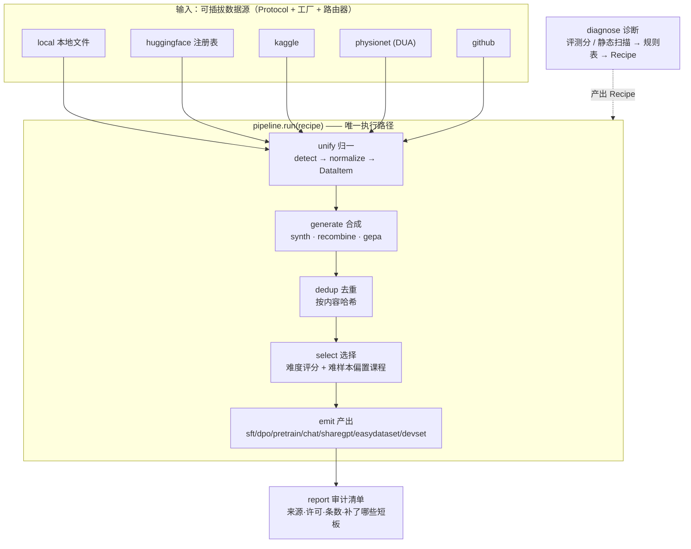

# agentdata · 训练数据的「诊断—配方—生产」中间件

> 夹在**原始数据源**和**训练管线**之间的一层通用中间件：从 HuggingFace / Kaggle / PhysioNet / GitHub / 本地
> 把数据拉进来、**统一成一种格式**，**诊断目标模型/Agent 的短板**并自动选定训练范式与数据类型，按需**合成数据**，
> 最后吐出训练器能直接吃的 JSONL —— 还附一份可审计的来源/许可清单。

`5 类数据源` · `7 种产出格式` · `覆盖 SFT/DPO/GRPO/CPT + 提示优化 + 多Agent + 记忆评测` · `LoCoMo 1986 条 + Claude-Opus 蒸馏 8669 条（已实测）` · `离线优先·无需密钥` · `Python`

---

## 一分钟看懂（无需训练或算法背景）

**遇到的问题**：想训练一个小模型或 Agent，第一步「准备数据」就很痛——数据散落在各个平台、格式五花八门
（有的叫 `instruction/output`，有的叫 `conversations`，有的是纯文本）；更难的是**到底该练什么**：
模型是数学差、还是多步推理差、还是基础知识不够？该用预训练、还是 SFT、还是偏好对齐（DPO/GRPO）？
选错了，再多数据也是白练。

**这个项目怎么做**：把「准备数据」拆成一条流水线，任何输入都先归一成一种内部格式（叫 `DataItem`），然后——

1. 先**诊断**：喂一份评测分数（或直接扫一个 SKILL/仓库），自动找出短板（哪类能力低于阈值）；
2. 再把短板**翻译成一张配方 `Recipe`**：该用哪种训练范式、配哪些数据源、要多大、要不要合成、要不要课程排序；
3. 最后**照配方生产**：拉数据 → 去重 → 难度课程选择 → 生成训练器能直接读的 JSONL + 审计清单。

> **一句话**：不是「攒一大堆数据硬塞给训练器」，而是**先替你把模型的短板诊断清楚，再按方抓药、抓完附药单**——
> 每条数据都能溯源到它从哪来、什么许可、为补哪个短板而来。

---

## 优化一个 Agent，有好几条路——它们要的数据完全不同

> 这是早期 README 最大的毛病：把「优化 Agent」约等于 GEPA 一种方法。其实优化是**两根正交的轴**——
> **改不改权重** × **拿什么信号**。看清这张表，才知道该准备哪种数据。

| 优化什么 | 代表方法 | 需要的数据 | 改权重? | agentdata 产出 |
|---|---|---|:--:|---|
| 权重·继续预训练 | CPT | 领域语料（纯文本） | ✓ | `pretrain` `{text}` |
| 权重·监督微调 | SFT / 蒸馏 | 指令-响应（可带 `<think>` CoT） | ✓ | `sft` / `chat` |
| 权重·偏好对齐 | DPO | 偏好对 chosen/rejected | ✓ | `dpo` |
| 权重·强化学习 | **GRPO** / PPO / RLOO | 提示 + **可验证奖励**（不需标准输出） | ✓ | 提示集（奖励函数在训练器侧） |
| **提示/程序（不动权重）** | **GEPA** · DSPy-MIPROv2 · TextGrad · OPRO | **少量样例 + 一个指标/反馈函数** | ✗ | `devset` `{input,target}` + 指标 |
| 记忆/检索 | agentmem 等 | 长对话 + 带证据 QA | ✗(外置) | `chat`（LoCoMo 重组） |
| 工具/轨迹 | AgentTuning · APIGen | 多轮工具调用轨迹 | ✓ | `chat`（角色/工具轨迹） |
| 多 Agent 协作 | CAMEL · AutoGen · 多智能体模拟 | 角色条件化的多方对话 | ✓ | `chat`/`sharegpt`（多角色） |

> **关键认知**：**GEPA 不改权重**——它优化的是提示词，和 SFT/GRPO 是正交的另一根轴，只需要「少量样例 + 一个指标」，
> 而不是海量训练数据。agentdata 是**训练数据**中间件，主战场是上表「改权重」那几行（SFT/DPO/GRPO/CPT）；
> 对**提示优化**这条线，它的角色是产出 GEPA/DSPy 要吃的「少量高质量样例 + 指标」。
> 所以「Agent 优化只有 GEPA」是错的——GEPA 只是其中**一个引用**，且与本工具的主战场正交。

---

## 核心概念（先读这 5 个词）

后面反复用到，先用大白话讲清楚（完整版见文末[名词速查](#名词速查)）：

- **`DataItem`（统一数据项）**：本项目内部唯一的「数据货币」。任何来源、任何格式进来都先归一成它；
  所有产出格式都从它出去。来源/标签/语言/是否可分发等细节都塞进 `meta`，主结构保持干净。
- **`Recipe`（配方）**：一次数据生产的完整说明书——范式、数据源、产出格式、目标条数、是否去重/课程排序/合成。
  **CLI 与 `/agentdata` skill 都先编译成同一个 `Recipe`，再交给 `pipeline.run()`**，永远只有一条执行路径。
- **诊断与范式**：把评测短板映射成训练范式（pretrain / continue-pretrain / SFT / DPO / GRPO）+ 数据类型
  （数学 / 推理 / 领域 / 意图 / 多模态）的那张规则表，就是这个工具的「自动大脑」。
- **`Emitter`（产出器）**：把 `DataItem` 写成某一类训练器要求的**精确 JSONL 模式**，并校验必填字段非空
  （训练器会悄悄丢弃残行）。新的训练目标 = 新的 Emitter，不动主流程。
- **溯源 / DUA 闸**：每份产出都附来源、许可、补了哪些短板。PhysioNet/MIMIC 这类受数据使用协议（DUA）
  约束的条目带 `redistributable=False`，**产出器会拒绝把它写进可分发文件**——守住合规底线。

---

## 看它怎么用

以下命令的输出均为**真实运行结果**（节选）。

### ① 诊断：评测分数 → 自动配方

```bash
agentdata diagnose --report examples/diagnose_to_recipe.json    # 仓库内自带这份示例评测
```

```text
diagnosis:
  math           0.29  GAP
  temporal       0.38  GAP
  multi_hop      0.41  GAP
  reasoning      0.55  GAP
  open_domain    0.71
  single_hop     0.82

gaps: ['math', 'temporal', 'multi_hop', 'reasoning']

recipe -> regime=grpo emit=sft size=800 sources=['hf:jackrong-claude-opus-distill', 'hf:locomo']
        generate={'verifiable': True, 'gepa': True, 'recombine': True}
```

> 读法：数学/时序/多跳/推理低于阈值 0.6 被判为短板；规则表据此选了 GRPO 范式、配上「Claude-Opus 蒸馏推理集
> + LoCoMo 时序会话」，并开启重组（recombine）与 GEPA 反馈轨迹。`--out recipe.yaml` 可把这张配方落盘。

### ② 构建：照配方生产训练数据

```bash
agentdata build --source local:sft_medical.jsonl --emit sft --size 200 --name demo
```

```text
emit=sft  wrote 200 samples -> out/demo.sft.jsonl
  sources=['local']  licenses=(none recorded)
  stats={'input': 200, 'written': 200, 'dropped': 0, 'gated_skipped': 0}
manifest -> out/demo.manifest.json
```

> 从 38 万条本地语料里，去重 → 按难度做「难样本偏置 + 易到难」课程选择，吐出 200 条 SFT JSONL 与一份
> 审计清单。也可以 `agentdata build --recipe recipe.yaml` 直接跑①生成的配方。

### ③ 评测/诊断一个记忆系统（是的，支持评测 agentmem）

姊妹项目 [`agentmem`](../agentmem) 的 `benchmark.py` 会吐出每个后端的检索质量 JSON
（`{hit1, hit3, clean, mrr}`）。直接喂给 `diagnose`，它会**挑出最弱的后端**、忽略时延/计数字段，
把短板翻译成「补长对话记忆数据」的配方：

```bash
agentdata diagnose --report examples/agentmem_bench.json     # agentmem benchmark 的真实输出格式
```

```text
diagnosis:
  clean          0.38  GAP
  hit1           0.42  GAP
  memory         0.46  GAP        ← 检索指标的合成能力轴
  mrr            0.49  GAP
  hit3           0.55  GAP

recipe -> regime=sft emit=chat size=1500 sources=['hf:locomo']
        generate={'recombine': True}
```

> 即「agentmem 的 `vector` 后端检索偏弱 → 用 LoCoMo 长对话**重组**成更密的多会话时间线来补」——
> agentdata 与 agentmem 共用 LoCoMo 这条线，形成「**评测记忆 → 生产记忆数据**」的闭环。

### ④ 生成多 Agent 训练数据（是的，支持多 Agent）

把多个相似主体的会话**重组成一段角色条件化的多方对话**：每个主体的发言被改写成不同的 agent 角色
（`agent1`/`agent2`/…），`chat`/`sharegpt` 产出器会原样保留这些角色：

```python
from agentdata.generate import recombine
ma = recombine(subjects, multi_agent=True)        # 角色条件化的多方对话
# -> messages 里出现 {"role": "agent1"} / {"role": "agent2"} ...，可直接喂多智能体微调
```

> 诊断侧也认得这条线：扫一个没有多 Agent/角色协调信号的 SKILL，会判出 `multi_agent` 短板，
> 配方自动带上 `generate={'multi_agent': True}`。

---

## 它好不好用（实测）

### 数据源实测（对 HuggingFace Hub 真连真测，2026-06-15）

| 配方 | 真实数据集 | 拉取结果 |
|------|-----------|---------|
| `hf:locomo` | `Percena/locomo-mc10` (likes 7, dl 970) | **1986 条 QA**，每行的 `question_type` 进入 `meta.tags`（正是诊断用的能力轴） |
| `hf:jackrong-claude-opus-distill` | `Jackrong/Claude-opus-4.6-TraceInversion-9000x` (likes 69, dl 1902) | **8669 条对话**，抽样 200 条**全部携带 `<think>` 推理轨迹** |
| `hf:agent-trajectory` | `agent-eto/eto-sft-trajectory` (likes 17, dl 224) | **3119 条多轮 Agent 轨迹**（AlfWorld 工具交互），sharegpt 直接归一；撑起「工具/轨迹」那条线 |

> 实测中还顺手抓出真实数据的坑：LoCoMo 的答案有时是整数（如 `2022`），归一化时会对非字符串字段做强制转换；
> 这两个数据集都不符合 `load_dataset` 默认布局，故配方里钉死了具体的数据文件，下载走「hub 客户端 → resolve 直链」
> 双通道（原子写 + 命中缓存复用），即便 Hub 的 Xet/CDN 后端不可达也能拿到。

### 数据集选择信号：HF 的 like / download 数很重要

挑数据集不能只看名字匹配——**`like`/`download` 数是关键的质量与可信度信号**。所以：
注册表里每条配方都记下注册时的 likes/downloads；新增配方前先用**按 likes 排序的实时检索**比一比：

```bash
agentdata sources --search "agent trajectory"     # 按 likes 排序的 Hub 实时检索
```

```text
huggingface datasets for 'agent trajectory' (by likes):
  likes=17    dl=224      hf:agent-eto/eto-sft-trajectory
  likes=12    dl=1709     hf:zake7749/Qwen-3.6-plus-agent-tool-calling-trajectory
  ...
```

> 上面 `hf:jackrong-...`（likes 69）正是同类「Claude 蒸馏推理」里最受欢迎的一个，而非随手第一个匹配；
> LoCoMo 的 HF 镜像普遍 like 很低（原始数据在 GitHub），注册表选的是其中 like 最高、且能干净归一的那个。

### 选择质量基准（`benchmark.py`，清晰信号池）

```text
metric                  pool      selected
count                   4000           400
mean-diff              1.174         1.516      ← 难样本偏置：平均难度被抬高
reasoning%             66.7%         83.8%      ← 带 <think> 的样本占比上升
dedup%        25.0%  (4000 → 3000)
monotonic     yes (easy→hard)                   ← 课程不变量：易到难
quartiles     Q1=40 Q2=80 Q3=120 Q4=160         ← 命中 10/20/30/40% 配额
throughput    load 531,699/s   dedup+select 146,657/s
```

> 信号清晰时配额命中得分毫不差；换成扁平的真实医疗语料（几乎没有 `<think>`、长度均匀），基准会**如实显示**
> 难度信号稀薄、课程偏置效果有限——不藏不掖。

---

## 为什么这样设计

几条与众不同、也是最花心思的地方：

- **一份合同，两个前端**：CLI 与 `/agentdata` skill（`.claude/skills/agentdata/`）都编译成同一个 `Recipe`，
  再调 `pipeline.run(recipe)`，绝不写第二条执行路径——skill 刻意做得很薄，只把自然语言意图翻译成同一条
  `agentdata` 命令，「命令行能跑的，skill 也一字不差地能跑」。
- **离线优先是硬约束**：核心路径（本地源、归一、诊断、产出、选择）**不联网、不需要任何密钥**就能跑通；
  每个可选依赖都藏在 extra 后面、**惰性导入并给出安装指引**，绝不污染核心导入。
- **统一货币 `DataItem`**：来源往里归一、产出器往外消费；来源/格式的特殊性一律进 `meta`，不往主结构加字段——
  加一个数据源、加一种产出格式，都不用碰主流程（沿用姊妹项目 `agentmem` 的 Protocol + 工厂 + 路由器范式）。
- **覆盖多条优化轴、不押注单一方法**：主战场是改权重的数据（SFT/DPO/GRPO/CPT），同时为提示优化族
  （GEPA/DSPy/TextGrad）产出「小 dev 集 + 指标」、为多 Agent 产出角色对话、为记忆系统（agentmem）做评测→产数据
  的闭环。借鉴 GEPA「丰富反馈/轨迹胜过堆量」的数据观（给样本挂 `feedback`/`trajectory`、保持小而高信号），
  但**不把它当作唯一方法**。
- **合规当作功能而非口号**：DUA 受限条目带 `redistributable=False`，产出器**直接拒写**进可分发文件，
  并在审计清单里记下「跳过了几条受限数据」。

---

## 架构

> 以下进入技术细节。一条流水线，五个可单独复跑的阶段：`load → generate → dedup → select → emit`。



> 不支持 mermaid 的查看器，可读作：
> **诊断**：`评测分数/静态扫描 → 规则表 → Recipe`；
> **生产**：`数据源 → 归一(DataItem) → (合成) → 去重 → 课程选择 → 产出 JSONL → 审计清单`。

---

## 快速开始

```bash
# ① 安装（核心极简：仅 python-dotenv + pyyaml）
pip install -e .                 # 核心：本地源、归一、诊断、产出、选择
pip install -e '.[hf]'           # + HuggingFace 数据源
pip install -e '.[gen]'          # + 合成（Anthropic 教师模型）
pip install -e '.[all,dev]'      # 全部 + pytest

# ② 配置（可选）：核心路径无需任何密钥
cp .env.example .env             # 仅当用到 HF/Kaggle/PhysioNet/合成 时才需填

# ③ 用起来
agentdata sources                                    # 列出数据源 + HF 注册表 + 本地文件
agentdata diagnose --report eval.json --out recipe.yaml
agentdata build   --recipe recipe.yaml
agentdata build   --source local:sft_medical.jsonl --emit sft --size 200
agentdata stage   load --recipe recipe.yaml          # 单独复跑某一阶段做检查
```

### CLI 速查

| 命令 | 作用 |
|------|------|
| `sources` | 列出数据源、HF 命名配方（含 likes）、`DATA_DIR` 下的本地文件 |
| `sources --search <q>` | 按 HF likes 排序实时检索数据集（受欢迎度作为质量信号） |
| `diagnose --report <json>` | 解析评测分数 → 打印短板与自动配方（`--out` 落盘配方） |
| `diagnose --scan <path>` | 静态扫描 SKILL.md / 仓库找能力缺口（无评测时用） |
| `build --recipe <file>` | 按配方跑完整流水线 |
| `build --source <spec> --emit <fmt> --size N` | 不写配方、用 flag 直接构建 |
| `stage <load\|generate\|dedup\|select\|emit> ...` | 只跑到某一阶段，返回中间结果供检查 |

**数据源 spec**：`local:sft.jsonl` · `hf:locomo` · `gh:owner/repo` · `kaggle:owner/dataset`，用 `,` 连成多源
（自动扇出 + 按哈希去重 + 保留来源）。**产出格式**：`sft` `dpo` `pretrain` `chat` `sharegpt` `easydataset` `devset`（给 GEPA/DSPy 的 `{input,target}` 评测集）。

---

## 项目结构

```text
src/agentdata/
├─ types.py        DataItem / Recipe / Diagnosis / Manifest（dataclass，无重依赖）
├─ config.py       Config + from_env()，每个字段都有离线安全默认
├─ sources/        可插拔输入：base(Protocol) · __init__(工厂+路由器) · local/huggingface/kaggle/physionet/github
├─ unify/          detect（识别格式）+ normalize（→ 统一 DataItem）
├─ diagnose/       evalreport（解析分数）+ introspect（静态扫描）+ selector（规则表→Recipe）+ Diagnoser 门面
├─ generate/       llm/（mock/anthropic 教师）+ synth + recombine（按相似主体重组）+ gepa（反馈轨迹）
├─ emit/           base(Protocol+校验) · sft/dpo/pretrain/chat/sharegpt/easydataset/devset · convert · 工厂
├─ select/         dedup + score（难度）+ curriculum（难样本偏置 + 易到难）
├─ pipeline.py     run(recipe) / run_stage(stage, recipe)——唯一执行路径
├─ builder.py      DatasetBuilder 门面（吃 Recipe 对象 / dict / yaml / json）
├─ report.py       溯源/审计清单
└─ __main__.py     agentdata CLI（argparse）
tests/             test_smoke.py（离线 14 项）· test_live.py（RUN_LIVE=1 真连 HF）
examples/          local_to_sft.yaml · diagnose_to_recipe.json
benchmark.py       选择质量基准（去重/难度抬升/课程/吞吐）   demo.py  端到端离线演示
```

---

## 测试与基准

```bash
python tests/test_smoke.py     # 离线：不联网、不需密钥（14 项）
pytest tests/                  # 同上，pytest 可发现
RUN_LIVE=1 pytest tests/       # 选做：真连 HF 注册表（默认自动跳过）
python benchmark.py            # 选择质量基准（用 ../dataset 或合成池）
```

离线套件覆盖：数据源 Protocol 一致性、本地源加载 `../dataset`、每个产出器的 JSONL 合法性、
alpaca↔sharegpt↔chatml 往返、去重/课程的确定性、DUA 闸、诊断→配方规则表、合成的确定性与不可变性、
端到端构建 + 溯源清单。

---

## 设计取舍

- **为什么不直接用 `datasets.load_dataset` 一把梭**：很多真实数据集（LoCoMo、Jackrong）不符合默认 split 布局，
  且本环境 Hub 的 Xet/CDN 后端不可达。故注册表钉死数据文件，下载走「hub 客户端优先 → resolve 直链兜底」。
- **GRPO 配方为什么产 `sft` 而非 `dpo`**：GRPO 的「数据交付物」是高信号 SFT 集（蒸馏推理）；可验证奖励/偏好对
  属于训练器侧、无法在数据层凭空捏造，因此不把 GRPO 默认成一个（空的）DPO 导出。
- **课程选择为什么纯 Python**：难样本偏置 + 易到难只需 `random` + 一次性打分，避免 numpy 硬依赖，38 万条
  2.8 秒选完，且完全确定（同 seed 同结果）。
- **受限数据不分发**：PhysioNet/MIMIC 受 DUA 约束，仅用于「诊断」与驱动合成，产出器拒绝写入可分发 JSONL。

---

## 研究依据

> 按来源权威度组织（优先 arXiv 原文 / 官方仓库 / HF 数据卡，而非二手博客）。

**Agent 优化的全景（不止 GEPA）**
- **Self-Evolving Agents 综述**（[arXiv 2507.21046](https://arxiv.org/abs/2507.21046)）—— Agent 自进化的「改什么/何时/如何/在哪」框架，本项目「优化两根正交轴」表的来源。
- **提示/程序优化族**：**GEPA**（[arXiv 2507.19457](https://arxiv.org/abs/2507.19457)，反射式进化，比 GRPO 少 ~35× rollout）· **DSPy / MIPROv2**（[dspy.ai](https://dspy.ai/api/optimizers/GEPA/overview/)）· **TextGrad**（文本梯度反传）· **OPRO**。共性：**优化提示不改权重，只需少量样例 + 指标**。
- **权重微调与 RL**：SFT/蒸馏 · DPO · **GRPO**（可验证奖励、少而精的对，而非堆量）。

**数据合成与多 Agent**
- **多智能体模拟造数据**（[arXiv 2410.14251](https://arxiv.org/abs/2410.14251)）· **多 Agent 联合对齐**（[arXiv 2509.09629](https://arxiv.org/abs/2509.09629)）· **ConvoGen**（[arXiv 2503.17460](https://arxiv.org/abs/2503.17460)）· **AutoGen**（[arXiv 2308.08155](https://arxiv.org/abs/2308.08155)）/ CAMEL —— 角色对话→训练数据，本项目多 Agent 重组的依据。
- **Agent 轨迹微调**：AgentTuning · AgentOhana · APIGen-MT —— 多轮工具调用轨迹蒸馏。

**记忆与重组**
- **LoCoMo**（[arXiv 2402.17753](https://arxiv.org/abs/2402.17753)）—— QA 类别作为诊断能力轴；persona+事件图作为重组模板；与 [`agentmem`](../agentmem) 的记忆评测共用此线。
- **Persona Hub** —— persona 驱动扩展。**Claude-Opus 蒸馏集** + **easy-dataset** 导出兼容。

---

## 名词速查

| 名词 | 一句话解释 |
|------|-----------|
| **`DataItem`** | 内部统一数据项。任何来源/格式归一成它，所有产出从它出去；细节进 `meta`。 |
| **`Recipe`（配方）** | 一次数据生产的完整说明书（范式/源/格式/条数/去重/课程/合成）。CLI 与 skill 都编译成它。 |
| **范式（regime）** | 训练方式：pretrain（预训练）/ continue-pretrain（继续预训练）/ SFT / DPO / GRPO。 |
| **诊断（diagnose）** | 从评测分数或静态扫描里找出低于阈值的能力短板，映射成配方。 |
| **`Emitter`（产出器）** | 把 DataItem 写成某类训练器要求的精确 JSONL（SFT=`instruction/input/output`，DPO=`prompt/chosen/rejected` 等）。 |
| **课程选择（curriculum）** | 按难度做「难样本偏置」分层抽样（Q1..Q4=10/20/30/40%）再「易到难」排序。 |
| **去重（dedup）** | 按内容哈希（最后一句用户话）去掉重复样本。 |
| **溯源 / provenance** | 每份产出附来源、许可、补了哪些短板的审计清单。 |
| **DUA / `redistributable`** | 数据使用协议。受限条目标 `redistributable=False`，产出器拒绝写进可分发文件。 |
| **提示优化（prompt opt）** | 优化提示词**不改权重**的一族方法（GEPA/DSPy-MIPRO/TextGrad/OPRO），只需少量样例 + 指标，与 SFT/GRPO 正交。 |
| **GEPA** | 提示优化族中的一员（反射式进化）。本项目借其「丰富反馈胜过堆量」的数据观，但**它只是众多方法之一**。 |
| **多 Agent 重组** | 把多个相似主体的会话合并并赋予不同 agent 角色（agent1/agent2…），产出可训练的多方对话。 |
| **记忆评测闭环** | 吃 agentmem benchmark 的 {hit1,hit3,mrr} → 判记忆短板 → 产 LoCoMo 重组数据。 |
| **HF likes/downloads** | 数据集的受欢迎度，重要的质量/可信度信号；注册表记录之，`sources --search` 按 likes 排序。 |
| **LoCoMo** | 长期对话记忆基准；其 QA 类别（单跳/多跳/时序/开放域）被本项目用作诊断能力轴。 |

---

> 许可：MIT（见 [`LICENSE`](./LICENSE)）。贡献指南见 [`CONTRIBUTING.md`](./CONTRIBUTING.md)。
